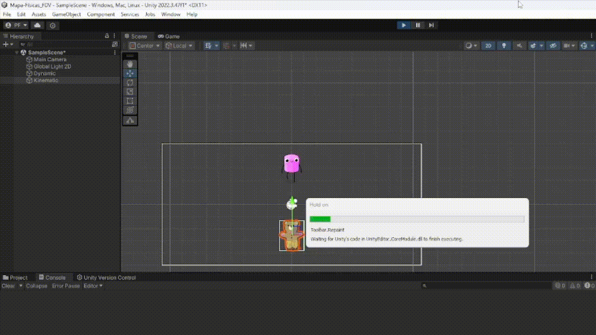
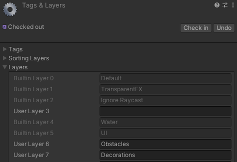
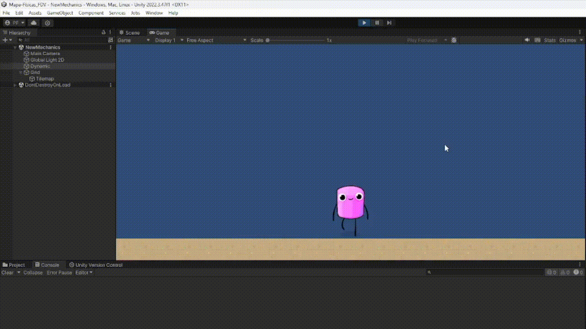

# Mapa_Fisicas-2D

Está práctica ser divide en 3 bloques.
1. Un primer bloque dedicado a las físicas en Unity 2D
2. Un segundo bloque dedicado a los Tilemaps
3. Un tercer bloque dedicado a hacer una serie de mecánicas

## Físicas 2D

### Actividad 1

1. **Ninguno de los objetos será físico.**
2. **Un objeto tiene físicas y el otro no.**
3. **Ambos objetos tienen físicas.**
4. **Ambos objetos tienen físicas y uno de ellos tiene 10 veces más masa que el otro.**
5. **Un objeto tiene físicas y el otro es IsTrigger.**
6. **Ambos objetos son físicos y uno de ellos está marcado como IsTrigger.**
7. **Uno de los objetos es cinemático.**

#### Escena Básica

Voy a crear dos objetos simples en la escena: 
- **Dynamic**: Será el primer objeto que cambiamos su configuración para cada uno de los casos, será dinámico.
- **Kinematic**: Será el segundo objeto que también ajustaremos de acuerdo a los requerimientos, será cinemático.

Cada uno de estos objetos tendrá un ```Collider2D``` (para permitir colisiones), y algunos tendrán ```Rigidbody2D``` (para añadir físicas). Dependiendo del caso, tendre que ajustar sus propiedades para hacerlos dinámicos, cinemáticos, estáticos o triggers.

#### Script Base (aplicable a todos los casos)
Creo un script base para manejar los eventos de colisión y de trigger. Este script se aplicará a ambos objetos.

```csharp
using UnityEngine;

public class PhysicsTest : MonoBehaviour
{
    // Este método se llamará cuando ocurra una colisión física
    private void OnCollisionEnter2D(Collision2D collision)
    {
        Debug.Log(gameObject.name + " ha colisionado con " + collision.gameObject.name);
    }

    // Este método se llamará cuando se active un trigger
    private void OnTriggerEnter2D(Collider2D collider)
    {
        Debug.Log(gameObject.name + " ha activado el trigger con " + collider.gameObject.name);
    }
}
```

#### Configuración de los Casos:

a. **Ninguno de los objetos será físico.**
   - Configuración
        - Ninguno tiene ```Rigidbody2D```, solo tienen ```Collider2D```.
   - Resultado
        - No se activa ni ```OnCollision2D``` ni ```OnTrigger2D``` porque no hay físicas involucradas. Las colisiones no se detectarán**.


*Figura 1: Objetos superpuestos*

b. **Un objeto tiene físicas y el otro no.**
   - Configuración:
        - **Dynamic**: Añadimos un ```Rigidbody2D```(dinámico).
        - **Kinematic**: Solo tiene ```Collider2D``` sin ```Rigidbody2D```.

   - Resultado
        - Ocurre colisión ya que Unity requiere que al menos uno de ellos tenga Rigidbody para detectar colisiones y se activa el método ```OnCollisionEnter2D``` mostrando un mensaje en la consola.


*Figura 2: Colisión entre los objetos*

c. **Ambos objetos tienen físicas.**
   - Configuración: 
        - **Dynamic**: Añadimos un ```Rigidbody2D``` (dinámico).
        - **Kinematic**: Añadimos un ```Rigidbody2D``` (cinemático).

   - Resultado
        - Se activa el método ```OnCollisionEnter2D``` cuando los objetos colisionan, y se muestra un mensaje en la consola.

d. **Ambos objetos tienen físicas y uno de ellos tiene 10 veces más masa que el otro.**
   - Configuración
        - **Dynamic**: ```Rigidbody2D``` cinemático con masa estándar (ej. 1).
        - **Kinematic**: ```Rigidbody2D``` dinámico con masa multiplicada por 10 (ej. masa = 10).

   - Resultado
        - La colisión ocurre y se muestra el mensaje en la consola. Al ser cinemático el otro objeto, cuando cae encima o se ve afectado por la masa.

e. **Un objeto tiene físicas y el otro es IsTrigger.**
   - Configuración
        - **Dynamic**: ```Rigidbody2D``` dinámico.
        - **Kinematic**: ```Collider2D``` marcado como ```IsTrigger```.

   - Resultado
        - Se activa el método ```OnTriggerEnter2D``` cuando el objeto con físicas entra en contacto con el trigger, mostrando un mensaje en la consola.



*Figura 3: Colisión con isTrigger activo*


f. **Ambos objetos son físicos y uno de ellos está marcado como IsTrigger.**
   - Configuración:
        - **Dynamic**: ```Rigidbody2D``` dinámico.
        - **Kinematic**: ```Rigidbody2D``` dinámico con el ```Collider2D``` marcado como ```IsTrigger```.
   - Resultado
        - Se activa ```OnTriggerEnter2D``` cuando uno entra en el área del otro (siendo IsTrigger), se muestra un mensaje en la consola.
        - Como consecuencia de ser un ser un Trigger, el objeto dinámico ignora la colisión pero activa ```OnTriggerEnter2D```.

g. **Uno de los objetos es cinemático.**
   - Configuración:
        - **Dynamic**: ```Rigidbody2D``` dinámico.
        - **Kinematic**: ```Rigidbody2D``` cinemático.
   - Resultado
        - La colisión ocurre y se activa ```OnCollisionEnter2D```. Los objetos pueden colisionar ya que el objeto cinemático puede chocar con dinámicos.

### Actividad 2

#### a. **Objeto estático que ejerce de barrera infranqueable:**
Este será un objeto que no se mueve y no permite que otros objetos lo atraviesen.

**Configuración:**
- Añadimos un objeto en la parte inferior de la pantalla sin textura con un componente ```BoxCollider2D```. A este objeto no se le agrega un ```Rigidbody2D```. 
- Esto lo convierte en un objeto estático que actúa como una barrera física, este barrera hará que los objetos dinámicos no puedan atravesarla.


*Figura 4: Colisión de Dynamic con Floor*

#### b. **Zona en la que los objetos que caen en ella son impulsados hacia adelante:**

Cree una zona que aplica una fuerza a cualquier objeto que entre en contacto con ella.

**Configuración:**
- Un objeto que actúe como la "zona de impulso" tendrá un ```Collider2D``` con la opción de ```IsTrigger``` activada.

**Script:**
```csharp
using UnityEngine;

public class ImpulseZone : MonoBehaviour
{
    public float force = 10f;

    private void OnTriggerEnter2D(Collider2D collider)
    {
        Rigidbody2D rb = collider.GetComponent<Rigidbody2D>();
        if (rb != null)
        {
            // Aplica una fuerza hacia adelante (eje X positivo).
            rb.AddForce(Vector2.right * force, ForceMode2D.Impulse);
            Debug.Log("Objeto impulsado hacia adelante.");
        }
    }
}
```

En este script, cuando un objeto con un ```Rigidbody2D``` entra en la zona, se le aplica una fuerza que lo impulsa hacia adelante.


*Figura 5: Personaje se impulsa con Impulse Zone*

#### c. **Objeto que es arrastrado por otro a una distancia fija:**

Aquí implementé el sistema de objetos conectados a través de una distancia fija, ```DistanceJoint2D```.

**Configuración:**
- Añado un ```DistanceJoint2D``` al objeto ```Dynamic``` y conectarlo al otro objeto, para que uno arrastre al otro.

1. Agrega un ```DistanceJoint2D``` al objeto que actúa como arrastrador.
2. Asigna el segundo objeto (el arrastrado) al campo de "Connected Body" del ```DistanceJoint2D```.


*Figura 6: Personaje se impulsa con Impulse Zone y desplaza al otro objeto*

#### d. **Objeto que al colisionar con otros sigue un comportamiento totalmente físico:**

Un objeto que se comporta de acuerdo con la física realista será un objeto con un ```Rigidbody2D``` dinámico que responde a colisiones y fuerzas físicas de manera normal.

**Configuración:**
- Añade un ```Rigidbody2D``` y un ```BoxCollider2D``` al objeto.

#### e. **Dos capas que eviten colisiones entre ciertos tipos de objetos:**
En este punto tuve que crear dos capas diferentes para los objetos y configurar la colisión entre ellas.

**Configuración:**

1. Usando el menú de ```Layer``` de Unity y he creado dos capas nuevas, "LayerA" y "LayerB".
2. Asigno estas capas a diferentes tipos de objetos.
3. En el menú ```Edit > Project Settings > Physics2D```, desactivo las colisiones entre estas dos capas. En la tabla de colisiones de capas, desmarqué la casilla donde se cruzan "LayerA" y "LayerB".

La LayerA la puse en el objeto que se llama Kinematic y la LayerB en el objeto impulseZone, para que solo se impulse el objeto que se llama Dynamic.

## Tilemaps 

En este bloque estuve probando distintas cosas relacionadas con los Tilemaps en Unity 2D.

### a. Crea dos Tilemaps adicionales de obstáculos. Uno puede representar elementos decorativos y otro obstáculos

Tuve que crear dos Tilemaps: uno para las decoraciones llamado **Decorations** y otro para los obstáculos llamado **Obstacles** (ver Figura X). 

Para añadir elementos como Tiles al mapa del juego, utilicé el editor de sprites y los dividí adecuadamente, lo que facilitó su colocación en el entorno.


*Figura 7: Tilemaps de decoración y de obstaculos*

### b. Agrega a la capa de obstáculos la configuración necesaria para que el Tilemap se construya de forma independiente y el obstáculo actúe como tal.

#### I. Velocidad del renderizado muy alta: Activa detección de colisiones continua


*Figura 8: Configuración del RigidBody del Tilemap Obstacles*

#### II. Orden de las capas



*Figura 9: Añadir capas de Tilemaps*


*Figura 10: Configuración del Order in Layer*

Para la capa obstacles le he puesto el order in layer de 1, esto provoca que los elementos aparezcan por delante de decorations. Esto es para los elementos que se pueden haber quedado detrás.

#### III. Las capas permiten colisiones entre sí.


*Figura 11: Layer Collision Matrix*

#### IV. Tamaño y forma de los colliders. Se puede corregir editando el Sprite para adaptar la forma al objeto y aplicar Custom Physics Shape


*Figura 12: Forma adaptada con Custom Physics Shape*

#### V. Si has modificado la escala puede afectar a la detección de colisiones.

Al no haber modificado las escalas, no he sufrido de ningún problema con la detección de colisiones.

## Mecánicas Útiles 

En este bloque tuve que desarrollar una serie de mecánicas útiles para el desarrollo de videojuegos en Unity.

### Control del personaje basado en físicas

Para poder controlar a un personaje basado en físicas se debe hacer lo siguiente:

```csharp
public class PlayerMovement : MonoBehaviour
{
    public float velocity = 5f;

    private Rigidbody2D rb2D;
    private SpriteRenderer spriteRenderer;

    void Start()
    {
        rb2D = GetComponent<Rigidbody2D>();
        spriteRenderer = GetComponent<SpriteRenderer>();
    }

    void FixedUpdate()
    {
        Movement();
    }

    private void Movement()
    {
        float moveH = Input.GetAxis("Horizontal");

        ...

        Vector2 vtranslate = new Vector2(moveH * velocity * Time.deltaTime, 0);
        rb2D.MovePosition(rb2D.position + vtranslate);
    }
}
```

Un problema con este script es que la gravedad del personaje se ve afectada, ya que este cae más lento que cuando no se usaba el script.

### Salto

```csharp
public class PlayerMovement : MonoBehaviour
{
    public float velocity = 5f;
    public float thrust = 5f;
    private bool isJumping = false;

    private Rigidbody2D rb2D;
    private SpriteRenderer spriteRenderer;

    void Start()
    {
        rb2D = GetComponent<Rigidbody2D>();
        spriteRenderer = GetComponent<SpriteRenderer>();
    }

    void FixedUpdate()
    {
        Movement();
    }

    private void Movement()
    {
        float moveH = Input.GetAxis("Horizontal");

        if (Input.GetButton("Jump") && !isJumping)
        {
            rb2D.AddForce(transform.up * thrust);
            isJumping = true;
        }

        ...
    }

    private void OnCollisionEnter2D(Collision2D other)
    {
        if (other.gameObject.CompareTag("Floor"))
        {
            isJumping = false;
            rb2D.velocity = new Vector2(rb2D.velocity.x, 0);
        }
    }
}
```



*Figura 13: Salto del personaje*

### Salto a una plataforma

Para esta mecánica tuve que hacer lo siguiente:

```csharp
public class PlayerMovement : MonoBehaviour
{
    ...

    private void OnCollisionEnter2D(Collision2D other)
    {
        if (other.gameObject.CompareTag("Floor") || other.gameObject.CompareTag("Platform"))
        {
            isJumping = false;
            rb2D.velocity = new Vector2(rb2D.velocity.x, 0);
        }

        if (other.gameObject.CompareTag("Platform"))
        {
            transform.parent = other.transform;
        }
    }

    // Detectar cuando sale de la plataforma
    private void OnCollisionExit2D(Collision2D collision)
    {
        if (collision.gameObject.CompareTag("Platform"))
        {
            transform.parent = null; 
        }
    }
}
```


*Figura 14: Personaje sobre la plataforma*

En Figura 13 se puede ver al personaje sobre la plataforma, cuando el jugador cae sobre la plataforma se puede ver en la jerarquía como el personaje se vuelve hijo de la plataforma.

### Manejar colisiones con elementos de una capa determinada

Para el funcionamiento de esta mecánica se requiere crear la capa **NoCollis** y en el siguiente script se muestra el funcionamiento de la misma.

```csharp
public class PlayerMovement : MonoBehaviour
{
    ...

    private void OnCollisionExit2D(Collision2D collision)
    {
        ...

        if (collision.gameObject.layer != LayerMask.NameToLayer("NoCollis"))
        {
            Debug.Log("Colisión detectada con un objeto en una capa válida.");
        }
        else
        {
            Debug.Log("Colisión ignorada con un objeto de la capa 'NoCollis'.");
        }
    }
}
```


*Figura 15: Colision con elemento de una capa*

### Plataformas invisibles que se vuelven visibles

Igual que en la anterior mecánica para que funcione tuve que crear la capa **PlatInv** y en el siguiente script se muestra el funcionamiento de la misma.

```csharp
public class PlayerMovement : MonoBehaviour
{
    ...

    private void OnCollisionEnter2D(Collision2D other)
    {
        ...

        if (other.gameObject.layer == LayerMask.NameToLayer("PlatInv"))
        {
            other.gameObject.GetComponent<TilemapRenderer>().enabled = true;
        }
    }

    private void OnCollisionExit2D(Collision2D collision)
    {
        ...

        if (collision.gameObject.layer == LayerMask.NameToLayer("PlatInv"))
        {
            collision.gameObject.GetComponent<TilemapRenderer>().enabled = false;
        }
    }
}
```

En está mecánica cuando el jugador colisione con una plataforma que se encuentra en dicha capa la plataforma aparece y desaparece cuando el jugador deja de colisionar con dicha capa.


*Figura 16: Colision con plataforma invisible*

### Mecánica de recolección

Para esta mecánica, implementé un canvas que muestra un texto indicando la cantidad de objetos que ha recogido el personaje. Además, añadí los delegados correspondientes y un script que se suscribe al evento para actualizar la información en tiempo real.

```csharp
public class PlayerMovement : MonoBehaviour
{
    ...

    public delegate void ItemCollected(int totalItemsCollected);
    public event ItemCollected onItemCollected;

    private int itemsCollected = 0;

    ...

    private void OnCollisionEnter2D(Collision2D other)
    {
        ...

        if (other.gameObject.CompareTag("Item"))
        {
            AddItem(other);
        }
    }

    private void AddItem(Collision2D item)
    {
        itemsCollected++;
        if (onItemCollected != null)
        {
            onItemCollected(itemsCollected);
        }
        onItemCollected.Invoke(itemsCollected);
        Destroy(item.gameObject);
    }

    ...
}
```

```csharp
public class Subscriptor : MonoBehaviour
{
    public PlayerMovement player;
    public Text itemCounterText;

    void Start()
    {
        player.onItemCollected += UpdateItemCounter;
    }

    void UpdateItemCounter(int totalItemsCollected)
    {
        itemCounterText.text = "Items Collected: " + totalItemsCollected.ToString();
    }

    void OnDestroy()
    {
        player.onItemCollected -= UpdateItemCounter;
    }
}
```


*Figura 17: Personaje recolentado un objeto*